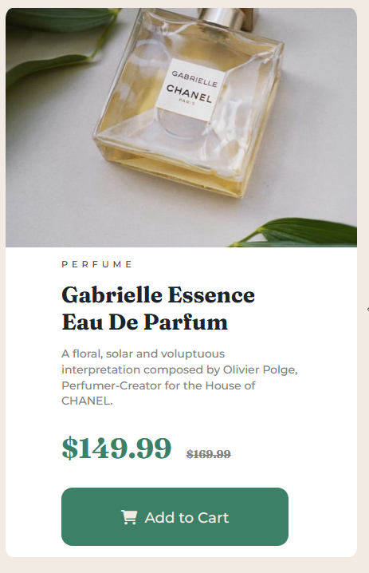

# Frontend Mentor - Product preview card component solution

This is a solution to the [Product preview card component challenge on Frontend Mentor](https://www.frontendmentor.io/challenges/product-preview-card-component-GO7UmttRfa). Frontend Mentor challenges help you improve your coding skills by building realistic projects. 

## Table of contents

- [Overview](#overview)
  - [The challenge](#the-challenge)
  - [Screenshot](#screenshot)
  - [Links](#links)
- [My process](#my-process)
  - [Built with](#built-with)
  - [What I learned](#what-i-learned)
  - [Continued development](#continued-development)
- [Author](#author)
- [Acknowledgments](#acknowledgments)

**Note: Delete this note and update the table of contents based on what sections you keep.**

## Overview

### The challenge

Users should be able to:

- View the optimal layout depending on their device's screen size
- See hover and focus states for interactive elements

### Screenshot

|  |
|:--:|
| <b>Desktop View</b>

|  |
|:--:|
| <b>Mobile View</b>

### Links

- Solution URL: [Github Code](https://github.com/aldojack/Product-Preview-Card)
- Live Site URL: [Github Pages](https://aldojack.github.io/Product-Preview-Card/)

## My process

### Built with

- Semantic HTML5 markup
- CSS custom properties
- Flexbox
- Mobile-first workflow

I started with basic html markup and classes before working top down adding my typography adding styling as I went out, once happy with the layout I then focused on desktop responsive

### What I learned

Renforcing previous learning on using flexbox for components and some other flex properties like flex basis

### Continued development

Continue to work using flex especially when working with images still feels a bit of an anomaly with how they react to css.  

## Author

- Website - [Alan Jack](https://github.com/aldojack)
- Frontend Mentor - [@aldojack](https://www.frontendmentor.io/profile/yourusername)

## Acknowledgments

Mostly Scrimba and Kevin Powells Youtube
